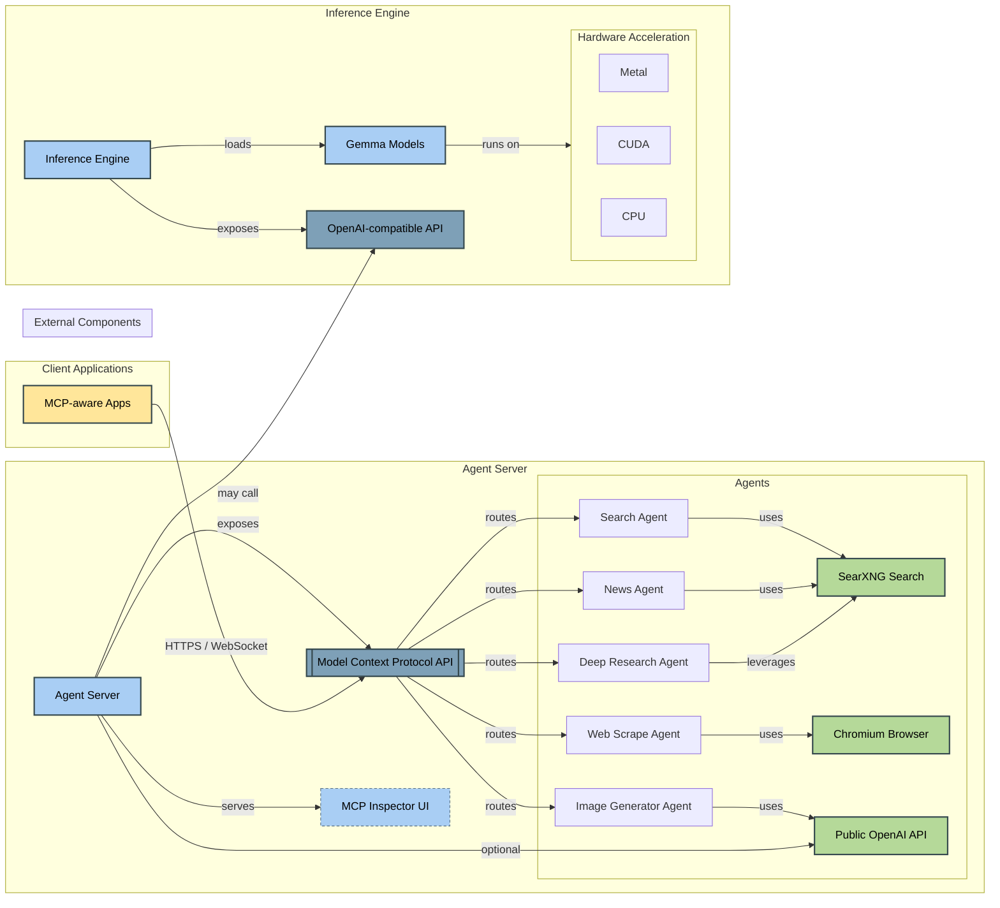

# open-web-agent-rs
[](https://github.com/seemueller-io/open-web-agent-rs/actions/workflows/main.yml)
[](https://opensource.org/licenses/MIT)

A Rust-based web agent with an embedded OpenAI-compatible inference server (supports Gemma models only). It is packaged and deployed as a container.

## Project Structure

This project is organized as a Cargo workspace with the following crates:

- `crates`
  - [agent-server](crates/agent-server): The main web agent server
  - [inference-engine](crates/inference-engine): An embedded OpenAI-compatible inference server for Gemma models
- `packages`
  - [genaiscript](packages/genaiscript): GenaiScript scripts  
  - [genaiscript-rust-shim](packages/genaiscript-rust-shim): An embedded OpenAI-compatible inference server for Gemma models

## Acknowledgements

Special gratitude and thanks:

- [OpenAI](https://openai.com): For standards that offer consensus in chaos.
- The [Rust](https://www.rust-lang.org) community for their excellent tools and libraries
- Google's [Gemma](https://deepmind.google/models/gemma) team for [gemma-3-1b-it](https://huggingface.co/google/gemma-3-1b-it)

### Open source projects that have inspired and enabled this work
- **[GenAIScript](https://github.com/microsoft/genaiscript)**: Automatable GenAI Scripting
- **[axum](https://github.com/tokio-rs/axum)**: Web framework for building APIs
- **[tokio](https://github.com/tokio-rs/tokio)**: Asynchronous runtime for efficient concurrency
- **[serde](https://github.com/serde-rs/serde)**: Serialization/deserialization framework
- **[rmcp](https://github.com/model-context-protocol/rmcp)**: Model Context Protocol SDK for agent communication
- **[sled](https://github.com/spacejam/sled)**: Embedded database for persistent storage
- **[tower-http](https://github.com/tower-rs/tower-http)**: HTTP middleware components
- **[candle-core](https://github.com/huggingface/candle)**: ML framework for efficient tensor operations
- **[candle-transformers](https://github.com/huggingface/candle/tree/main/candle-transformers)**: Implementation of
  transformer models in Candle
- **[hf-hub](https://github.com/huggingface/hf-hub)**: Client for downloading models from Hugging Face
- **[tokenizers](https://github.com/huggingface/tokenizers)**: Fast text tokenization for ML models
- **[safetensors](https://github.com/huggingface/safetensors)**: Secure format for storing tensors

## Architecture Diagram



## Setup

1. Clone the repository
2. Copy the example environment file:
   ```bash
   cp .env.example .env
   ```
3. Install JavaScript dependencies:
   ```bash
   bun i
   ```
4. Start the SearXNG search engine:
   ```bash
   docker compose up -d searxng
   ```

## Running the Project

### Inference Engine

To run the local inference engine:

```bash
cd crates/inference-engine
cargo run --release -- --server
```

### Agent Server

To run the agent server:

```bash
cargo run -p agent-server
```

### Development Mode

For development with automatic reloading:

```bash
bun dev
```

## Building

To build all crates in the workspace:

```bash
cargo build
```

To build a specific crate:

```bash
cargo build -p agent-server
# or
cargo build -p inference-engine
```
